<!-- Optional: Add a banner image to make the repo pop -->
<p align="center">
  <!-- Replace with: ./assets/banner.png once you add a banner -->
  <!---->
</p>

<h1 align="center">🛡️ AWS Inspector Vulnerability Assessment (Lambda) — Network Hardening Lab</h1>

<p align="center">
  
  
  
  
  
</p>

> **Case study:** Enable **Amazon Inspector**, detect **package vulnerabilities** in an AWS **Lambda** function, remediate by updating dependencies, and **verify closure** of findings. This repo presents the full workflow with evidence screenshots and concise notes.

---

## 🔎 Quick Preview

- **What you’ll see:** Continuous scanning enabled → Findings (CVE on `requests`) → Lambda fix (`requirements.txt`) → Re‑scan → Findings **Closed**.
- **Skills shown:** Cloud security, vulnerability triage, secure dependency practices, validation & evidence.

---

## 🧭 Table of Contents

- [Project Overview](#project-overview)
- [Architecture & Tools](#architecture--tools)
- [Skills Demonstrated](#-skills-demonstrated)
- [Why This Project Matters](#-why-this-project-matters-in-real-world-security)
- [Walkthrough with Screenshots](#-walkthrough-with-screenshots)
  - [1) Activate & Validate Inspector](#1-activate--validate-inspector)
  - [2) Review Findings & Investigate CVEs](#2-review-findings--investigate-cves)
  - [3) Remediate in Lambda (Before → Change → After)](#3-remediate-in-lambda-before--change--after)
  - [4) Re‑scan & Verify Closure](#4-re-scan--verify-closure)
  - [5) Extra Context (Banners, IDs, NVD)](#5-extra-context-banners-ids-nvd)
  - [6) Task Guidance & Misc. UI](#6-task-guidance--misc-ui)
- [Mermaid Workflow Diagram](#-mermaid-workflow-diagram)
- [Learning Outcomes](#-learning-outcomes)
- [If This Were Production](#-if-this-were-a-production-environment)
- [How to Reproduce (Mini‑Guide)](#-how-to-reproduce-mini-guide)
- [Repo Structure](#-repo-structure)
- [License](#license)

---

## Project Overview

The (fictional) team **AnyCompany** is building a serverless app using **AWS Lambda**. To maintain a strong security posture during development, they enable **Amazon Inspector** for continuous scanning to detect:
- Vulnerable software packages (e.g., outdated Python libraries)
- Code and configuration issues across supported AWS resources

This case study shows how I:
1. Activated **Inspector** and confirmed Lambda coverage  
2. Reviewed **findings** for a Lambda function (`get-request`)  
3. Remediated a vulnerable dependency (`requests==2.20.0` → `requests`)  
4. **Validated** that findings moved to **Closed** after redeploy

---

## Architecture & Tools

**AWS:** Amazon Inspector, AWS Lambda (Python 3.10)  
**Security:** CVE review (NVD), remediation via dependency update  
**Evidence:** 25 screenshots, end‑to‑end workflow

---

## 🧠 Skills Demonstrated

- Cloud Security Architecture (AWS)
- Amazon Inspector configuration & analysis
- CVE triage & vulnerability management
- Secure dependency / package lifecycle management
- Python (Lambda) secure coding practices
- Interpreting CVSS and NVD CVE reports
- DevSecOps workflow thinking
- Evidence‑based remediation documentation

---

## 🔐 Why This Project Matters in Real‑World Security

Organizations deploying serverless architectures rely heavily on third‑party libraries.  
A single outdated dependency (like `requests==2.20.0`) can:
- Introduce data exposure vulnerabilities
- Break authentication flows or proxy handling
- Trigger compliance issues (PCI‑DSS, SOC2, ISO‑27001)
- Increase attack surface via CI/CD

Automated scanning with **Amazon Inspector** ensures continuous coverage and rapid identification of exploitable CVEs *before* production. The remediation loop here (Identify → Fix → Validate) mirrors what you’d run in a mature security program.

---

## 📸 Walkthrough with Screenshots

> Images live in `./screenshots`. Click to expand each section.

### 1) Activate & Validate Inspector
<details>
<summary><strong>Show Steps 1–4</strong></summary>

**Step 1 — Open the service**  
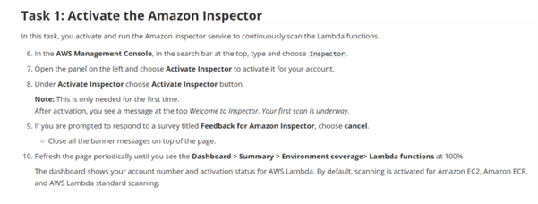

**Step 2 — Enable scanning**  
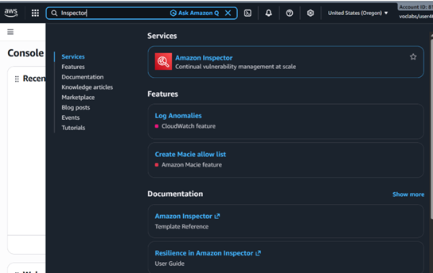

**Step 3 — Land on the dashboard**  
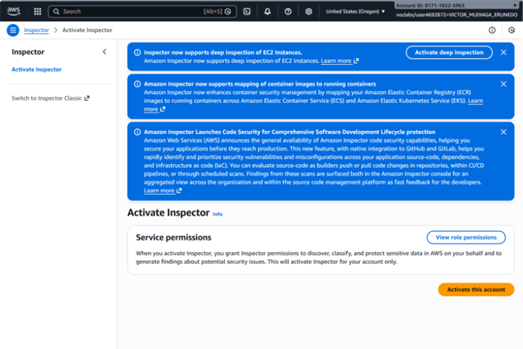

**Step 4 — Confirm environment coverage**  
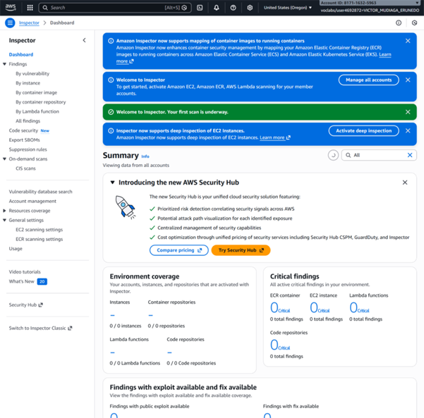

> 💡 *Inspector provides continuous scanning for resources like EC2, ECR, and Lambda—no per‑function manual scans required.*
</details>

---

### 2) Review Findings & Investigate CVEs
<details>
<summary><strong>Show Steps 5–7</strong></summary>

**Step 5 — Findings list (Active)**  
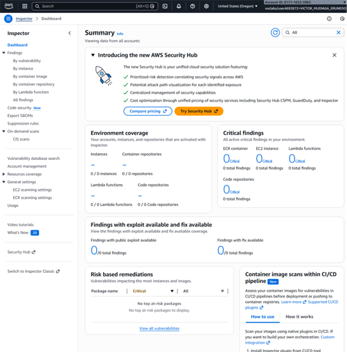

**Step 6 — Open CVE detail (requests library)**  
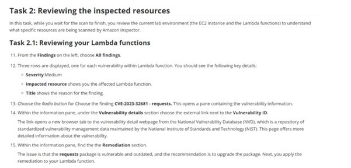

**Step 7 — Identify impacted Lambda**  
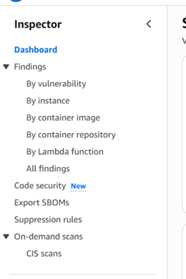

> 🔎 *Root cause:* The function pinned **`requests==2.20.0`**, which contains known vulnerabilities. Fixed versions are available.
</details>

---

### 3) Remediate in Lambda (Before → Change → After)
<details>
<summary><strong>Show Steps 8–10</strong></summary>

**Step 8 — BEFORE** (`requirements.txt` shows `requests==2.20.0`)  
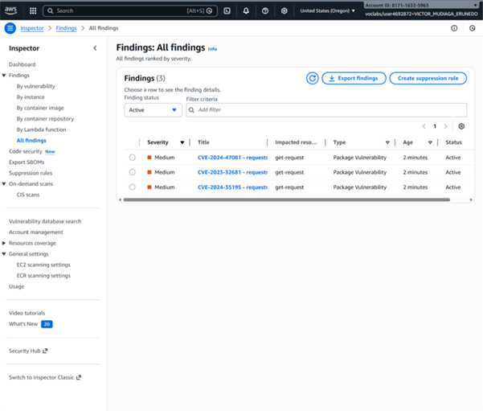

**Step 9 — Deploy change (banner)**  
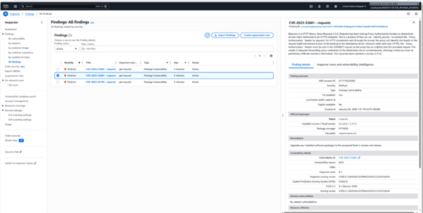

**Step 10 — AFTER** (`requirements.txt` updated to `requests` – unpinned)  
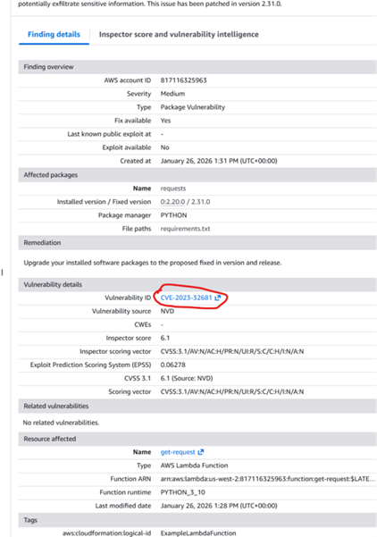

> 🛠️ *Change rationale:* Unpinning lets Lambda install the latest secure version (≥ fixed version), resolving the CVE while avoiding stale dependencies.
</details>

---

### 4) Re‑scan & Verify Closure
<details>
<summary><strong>Show Steps 11–15</strong></summary>

**Step 11 — Inspector re‑scan**  
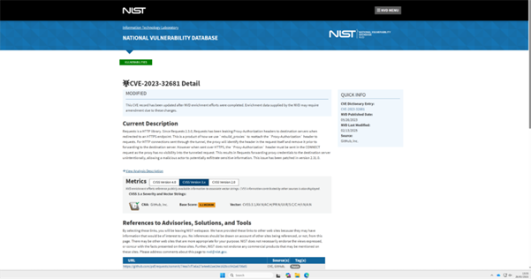

**Step 12 — Filter to Closed findings**  
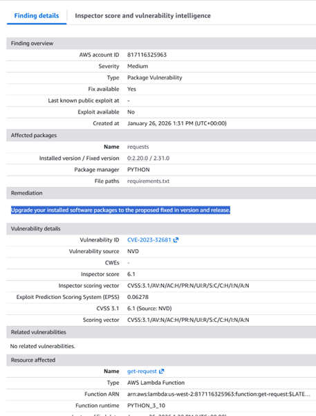

**Step 13 — Closed list (success)**  
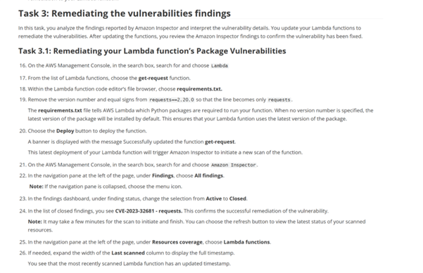

**Step 14 — Resource coverage**  
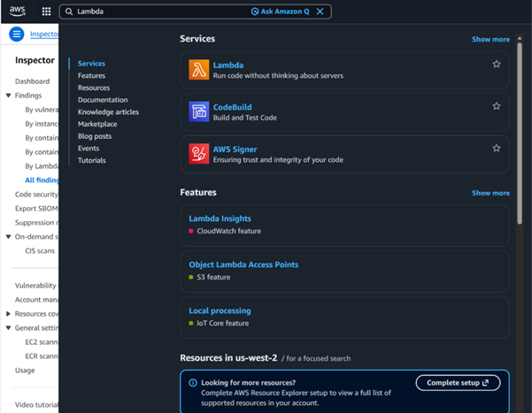

**Step 15 — Updated scan timestamp**  
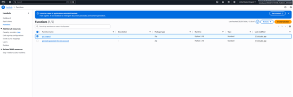

> ✅ *Outcome:* All previously active findings transitioned to **Closed** after remediation and redeployment.
</details>

---

### 5) Extra Context (Banners, IDs, NVD)
<details>
<summary><strong>Show Steps 16–20</strong></summary>

**Step 16 — Security Hub banner**  
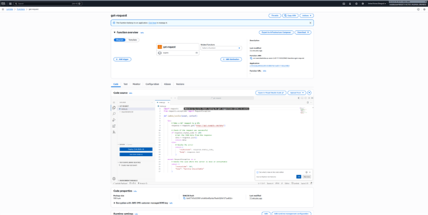

**Step 17 — Account context**  
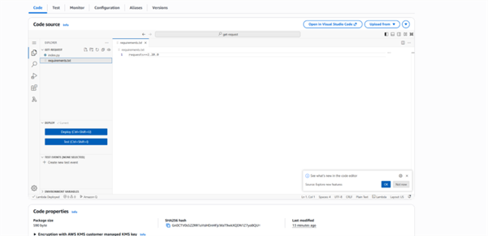

**Step 18 — NVD reference for the CVE**  
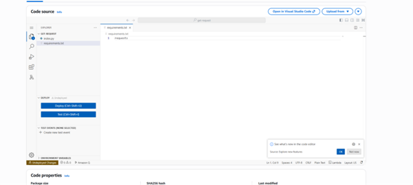

**Step 19 — Trial/usage banner**  
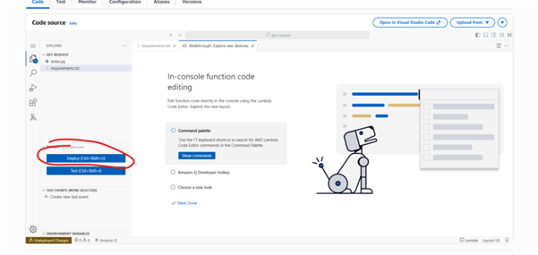

**Step 20 — On‑demand scans UI**  
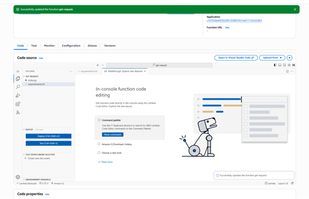
</details>

---

### 6) Task Guidance & Misc. UI
<details>
<summary><strong>Show Steps 21–25</strong></summary>

**Step 21 — Remediation instructions (lab guide)**  


**Step 22 — Account management view**  
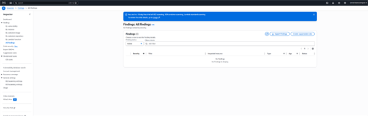

**Step 23 — Findings cleared (empty)**  
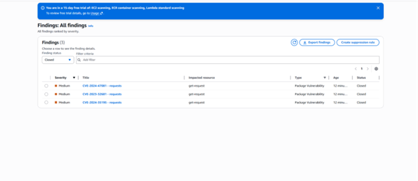

**Step 24 — Code security area**  


**Step 25 — Lambda settings page**  
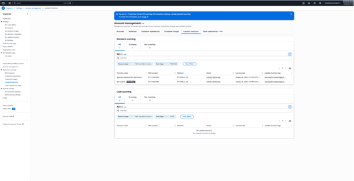
</details>

---

## 🧭 Mermaid Workflow Diagram

```mermaid
flowchart TD
    A[Enable Amazon Inspector] --> B[Inspector Scans Lambda]
    B --> C[Findings: CVEs Identified]
    C --> D[Remediate in Lambda - Update requirements.txt]
    D --> E[Deploy Lambda]
    E --> F[Inspector Re-scan]
    F --> G[Findings Closed and Timestamp Updated]
